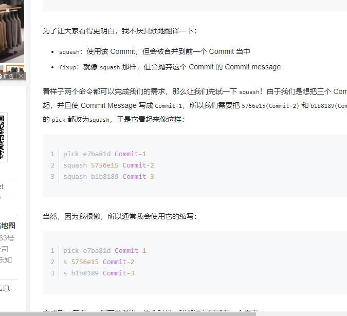

##### Git常用命令

1.创建仓库 `git init` 将项目装简称git仓库
2.将项目添加到版本库 `git add -A`
3.查看文件状态 `git status`
4.查看文件的修改 `git diff`
5.提交修改文件到仓库 `git commit -a -m '提交描述'`
6.查看提交记录 `git log`
7.git branch -a   查看本地&远程所有的分支
8.git branch -d <branchName>删除本地分支
9.git push origin --delete <BranchName>删除远程分支
10.git branch <branchName>新建分支

11.查看log  git log          git log -n2  查看近2次提交    git log -n2 --oneline 以行的方式显示


commit    --> tree  --> blob

git cat-file -t xxxxxx(hash值)查看类型

git cat-file -p xxxxxx(hash值)查看内容  最后显示文件内容


##### 撤销

---撤销---
git log  可以查看提交的id

###### --某个文件的撤销--

git log fileName      得到要回滚版本的hash值
git checkout hash值前六位  fileName
git commit -m 'message'
git push
---------完成某个文件的撤销------------

某个文件回滚
git log fileName
git reset hash值  fileName
git commit -m 'revert'
git checkout fileName
git push 


git reset --hard HEAD  撤销工作目录中所有未提交文件的修改内容

Git提供了 `git checkout -- filename` 命令,可以撤销对文件的修改到当前最新版本.同样的,用 `git reset HEAD filename` 也可以将修改的文件回退到最新的版本

**情况2:文件作出修改  已进行add操作 但是没有 commit   想要删除add**

git reset HEAD     撤销全部已提交修改

git reset HEAD filename    撤销对指定文件的修改

**情况四:文件作出修改已push到仓库**   

此次操作之前和之后的commit和history都会保留，并且把这次撤销作为一次最新的提交 
git revert HEAD  撤销前一次 commit 
git revert HEAD^  撤销前前一次 commit 
git revert commit-id  (撤销指定的版本，撤销也会作为一次提交进行保存） 
git revert是提交一个新的版本，将需要revert的版本的内容再反向修改回去，版本会递增，不影响之前提交的内容。

也可以使用reset 


##### 将多次commit合并成一次

git rebase  -i HEAD~最近几次提交次数 | 想要合并的hash值



/**********不同状态下的撤销&恢复******/

```
一，未加入缓存区，撤销文件修改
     git checkout -- file
二，已加入缓存区，撤销文件提交
     git reset HEAD file
     或git rm --cached file
三，已提交到本地，回滚提交
如果不小心 弄错了 git add后 ， 又 git commit 了。 
先使用 
git log 查看节点 
commit xxxxxxxxxxxxxxxxxxxxxxxxxx 
Merge: 
Author: 
Date:

然后 
git reset commit_id

over

PS：还没有 push 也就是 repo upload 的时候

git reset commit_id （回退到上一个 提交的节点 代码还是原来你修改的） 
git reset –-hard commit_id （回退到上一个commit节点， 代码也发生了改变，变成上一次的）
四，已push到远程
可以使用 git revert

还原已经提交的修改 
此次操作之前和之后的commit和history都会保留，并且把这次撤销作为一次最新的提交 
git revert HEAD 撤销前一次 commit 
git revert HEAD^ 撤销前前一次 commit 
git revert commit-id (撤销指定的版本，撤销也会作为一次提交进行保存） 
git revert是提交一个新的版本，将需要revert的版本的内容再反向修改回去，版本会递增，不影响之前提交的内容
git push 推送到远端

revert 注意是撤销某次操作，而不是恢复到

git revert用于反转提交,执行命令时要求工作树必须是干净的.
git revert用一个新提交来消除一个历史提交所做的任何修改.
revert 之后你的本地代码会回滚到指定的历史版本,这时你再 git push 既可以把线上的代码更新.(这里不会像reset造成冲突的问题)


******注意*******
建议，你可以用git revert来撤销已经提交的更改，而git reset用来撤销没有提交的更改
revert 注意是撤销某次操作，而不是恢复到
git revert是用一次新的commit来回滚之前的commit，git reset是直接删除指定的commit
看似达到的效果是一样的,其实完全不同.
第一:
上面我们说的如果你已经push到线上代码库, reset 删除指定commit以后,你git push可能导致一大堆冲突.但是revert 并不会.
第二:
如果在日后现有分支和历史分支需要合并的时候,reset 恢复部分的代码依然会出现在历史分支里.但是revert 方向提交的commit 并不会出现在历史分支里.
第三:
reset 是在正常的commit历史中,删除了指定的commit,这时 HEAD 是向后移动了,而 revert 是在正常的commit历史中再commit一次,只不过是反向提交,他的 HEAD 是一直向前的.

git reset -- files 使用当前分支上的修改覆盖暂存区，用来撤销最后一次 git add files
git checkout -- files 使用暂存区的修改覆盖工作目录，用来撤销本地修改
git commit -a 直接把所有文件的修改添加到暂存区然后执行提交
git checkout HEAD -- files 取出最后一次修改，可以用来进行回滚操作

```


##### git merge命令用于合并指定分支到当前分支。合并后，再查看readme.txt的内容，就可以看到，和dev分支的最新提交是完全一样的。

注意到上面的Fast-forward信息，Git告诉我们，这次合并是“快进模式”，也就是直接把master指向dev的当前提交，所以合并速度非常快。

查看分支：git branch

创建分支：git branch <name>

切换分支：git checkout <name>

创建+切换分支：git checkout -b <name>

合并某分支到当前分支：git merge <name>

删除分支：git branch -d <name>

用git log --graph命令可以看到分支合并图产品。   英文状态下按q  退出

##### 分支merge合并

git merge <branchName>  快速把分支合并到当前分支

 git merge --no-ff -m "merge with no-ff" dev       通常，合并分支时，如果可能，Git会用Fast forward模式，但这种模式下，删除分支后，会丢掉分支信息。

如果要强制禁用Fast forward模式，Git就会在merge时生成一个新的commit，这样，从分支历史上就可以看出分支信息，因为本次合并要创建一个新的commit


###### 暂停当前分支开发 修复错误分支

git stash   可以把当前工作现场“储藏”起来，等以后恢复现场后继续工作
git checkout <branchName> 切换分支修复错误
git checkout <branchName> 切换回原来的分支继续工作
git stash list 查看隐藏的工作
用一是git stash apply恢复，但是恢复后，藏匿内容并不删除，需要你用git stash drop来删除;
另一种方式是用git stash pop，恢复的同时把藏匿内容也删了：
git stash apply stash@{0}  指定恢复

##### 打标签

git tag <标签号>  默认是打在最新提交的commit上
比方说要对add merge这次提交打标签，它对应的commit id是f52c633，敲入命令：

还可以创建带有说明的标签，用-a指定标签名，-m指定说明文字：
git tag -a v0.1 -m "version 0.1 released" 1094adb

命令git push origin <tagname>可以推送一个本地标签；

命令git tag -d <tagname>可以删除一个本地标签；


git remote show origin 查看本地分支和追踪情况
git remote pruned origin  删除本地多余的分支（远程不存在的分支）


合并多个本地commit

```
git rebase -i  [startpoint]  [endpoint]
```

其中`-i`的意思是`--interactive`，即弹出交互式的界面让用户编辑完成合并操作，`[startpoint]`  `[endpoint]`则指定了一个编辑区间，如果不指定`[endpoint]`，则该区间的终点默认是当前分支`HEAD`所指向的`commit`(注：该区间指定的是一个前开后闭的区间)。
 在查看到了log日志后，我们运行以下命令：

pick：保留该commit（缩写:p）

reword：保留该commit，但我需要修改该commit的注释（缩写:r）

edit：保留该commit, 但我要停下来修改该提交(不仅仅修改注释)（缩写:e）

squash：将该commit和前一个commit合并（缩写:s）

fixup：将该commit和前一个commit合并，但我不要保留该提交的注释信息（缩写:f）

exec：执行shell命令（缩写:x）

drop：我要丢弃该commit（缩写:d）


修改commit信息：git commit --amend

查看暂存区和Head的区别  git diff --cached

HEAD指向某个commit ,回退到某个comiit(会丢失，慎用): 

```
git reset --hard <commit Hash>	git reset --hard HEAD
```


删除本地失效的远程分支

`git remote prune origin`

