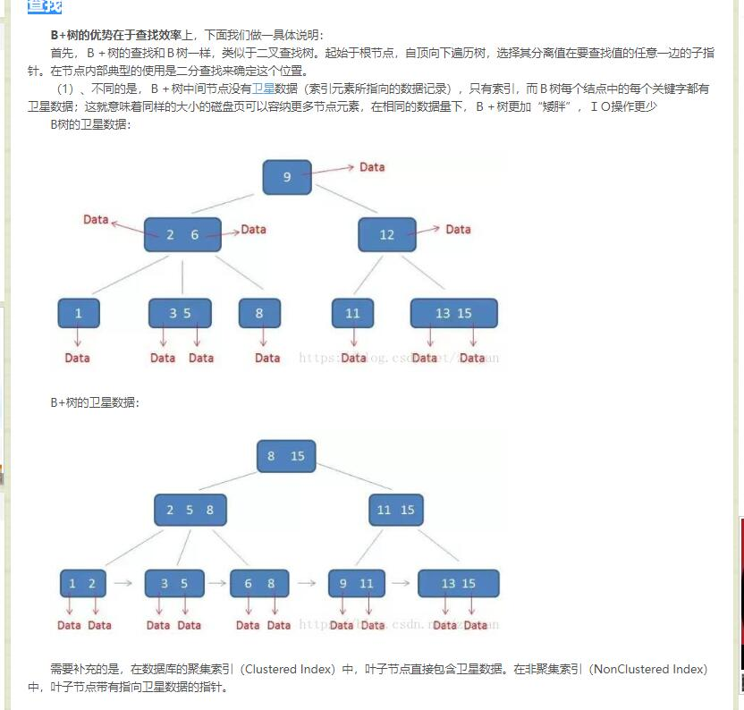

MyISAM存储引擎：由于该存储引擎不支持事务，也不支持外键，所以访问速度比较快。因此对事务完整性没有要求并以访问为主的应用适合使用。

InnonDB存储引擎：由于该存储引擎在事务上具有优势，即支持具有提交、回滚和崩溃恢复能力的事务安装，所以比MyISAM引擎占用更多的磁盘空间

varchar经常性设置成255是因为InnoDB引擎的表索引的前缀长度767字节有关。

ACID 
原子性:事务里面的操作单元不可切割,要么全部成功,要么全部失败 
一致性:事务执行前后,业务状态和其他业务状态保持一致.（指事务执行的结果必须是使数据库从一个一致性状态变到另一个一致性状态） 
隔离性:一个事务执行的时候最好不要受到其他事务的影响 
持久性:一旦事务提交或者回滚.这个状态都要持久化到数据库中 
不考虑隔离性会出现的读问题 
脏读:在一个事务中读取到另一个事务没有提交的数据 
不可重复读:在一个事务中,两次查询的结果不一致(针对的update操作) 

​	事务A首先读取了一条数据，然后执行逻辑的时候，事务B将这条数据改变了，然后事务A再次读取的时候，发现数据不匹配了，就是所谓的不可重复读了。

虚读(幻读):在一个事务中,两次查询的结果不一致(针对的insert操作) 

​	事务A首先根据条件索引得到N条数据，然后事务B改变了这N条数据之外的M条或者增添了M条符合事务A搜索条件的数据，导致事务A再次搜索发现有N+M条数据了，就产生了幻读。

通过设置数据库的隔离级别来避免上面的问题(理解) 
read uncommitted 读未提交 上面的三个问题都会出现 
read committed 读已提交 可以避免脏读的发生 
repeatable read 可重复读 可以避免脏读和不可重复读的发生 

serializable 串行化 可以避免所有的问题

读未提交是指，一个事务还没提交时，它做的变更就能被别的事务看到。
读提交是指，一个事务提交之后，它做的变更才会被其他事务看到。
可重复读是指，一个事务执行过程中看到的数据，总是跟这个事务在启动时看到的数据是一
致的。当然在可重复读隔离级别下，未提交变更对其他事务也是不可见的。
串行化，顾名思义是对于同一行记录，“写”会加“写锁”，“读”会加“读锁”。当出现
读写锁冲突的时候，后访问的事务必须等前一个事务执行完成，才能继续执行。

B-树（B型树索引） 

1.有k个子树的中间节点包含有k个元素（B树中是k-1个元素），每个元素不保存数据，只用来索引，所有数据
都保存在叶子节点。

2.所有的叶子结点中包含了全部元素的信息，及指向含这些元素记录的指针，且叶子结点本身依关键字的大小
自小而大顺序链接。

3.所有的中间节点元素都同时存在于子节点，在子节点元素中是最大（或最小）元素。

  哈希表（哈希索引）

普通索引、唯一索引、全文索引、单列索引、多列索引、空间索引

一下情况适合创建索引：

​	经常被查询的字段，即在where子句中出现

​	在分组的字段，即在group by 子句中出现

​	设置唯一完整性约束的字段

mysql中各个模块

会引起全表扫描的几种SQL 1、模糊查询效率很低： 　　原因：like本身效率就比较低，应该尽量避免查询条件使用like；对于like ‘%...%’（全模糊）这样的条件，是无法使用索引的，全表扫描自然效率很低；另外，由于匹配算法的关系，模糊查询的字段长度越大，模糊查询效率越低。 　　解决办法：首先尽量避免模糊查询，如果因为业务需要一定要使用模糊查询，则至少保证不要使用全模糊查询，对于右模糊查询，即like ‘…%’，是会使用索引的；左模糊like 　　‘%...’无法直接使用索引，但可以利用reverse + function index 的形式，变化成 like ‘…%’；全模糊是无法优化的，一定要的话考虑用搜索引擎。出于降低数据库服务器的负载考虑，尽可能地减少数据库模糊查询。 　　2、查询条件中含有is null的select语句执行慢 　　原因：Oracle 9i中，查询字段is null时单索引失效，引起全表扫描。 　　解决方法：SQL语法中使用NULL会有很多麻烦，最好索引列都是NOT NULL的；对于is null，可以建立组合索引，nvl(字段,0),对表和索引analyse后，is null查询时可以重新启用索引查找,但是效率还不是值得肯定；is not null 时永远不会使用索引。一般数据量大的表不要用is null查询。 　　3、查询条件中使用了不等于操作符（<>、!=）的select语句执行慢 　　原因：SQL中，不等于操作符会限制索引，引起全表扫描，即使比较的字段上有索引 　　解决方法：通过把不等于操作符改成or，可以使用索引，避免全表扫描。例如，把column<>’aaa’，改成column<’aaa’ or column>’aaa’，就可以使用索引了。 　　4、使用组合索引，如果查询条件中没有前导列，那么索引不起作用，会引起全表扫描；但是从Oracle9i开始，引入了索引跳跃式扫描的特性，可以允许优化器使用组合索引，即便索引的前导列没有出现在WHERE子句中。例如：create index skip1 on emp5(job,empno); 全索引扫描 select count(*) from emp5 where empno=7900; 索引跳跃式扫描 select /*+ index(emp5 skip1)*/ count(*) from emp5 where empno=7900; 前一种是全表扫描，后一种则会使用组合索引。 　　5、or语句使用不当会引起全表扫描 　　原因：where子句中比较的两个条件，一个有索引，一个没索引，使用or则会引起全表扫描。例如：where A=：1 or B=：2，A上有索引，B上没索引，则比较B=：2时会重新开始全表扫描。 　　6、组合索引，排序时应按照组合索引中各列的顺序进行排序，即使索引中只有一个列是要排序的，否则排序性能会比较差。例如：create index skip1 on emp5(job,empno，date); select job，empno from emp5 where job=’manager’and empno=’10’ order by job,empno,date desc; 实际上只是查询出符合job=’manager’and empno=’10’条件的记录并按date降序排列，但是写成order by date desc性能较差。 　　7、Update 语句，如果只更改1、2个字段，不要Update全部字段，否则频繁调用会引起明显的性能消耗，同时带来大量日志。 　　8、对于多张大数据量（这里几百条就算大了）的表JOIN，要先分页再JOIN，否则逻辑读会很高，性能很差。 　　9、select count(*) from table；这样不带任何条件的count会引起全表扫描，并且没有任何业务意义，是一定要杜绝的。 　　10、sql的where条件要绑定变量，比如where column=：1，不要写成where column=‘aaa’，这样会导致每次执行时都会重新分析，浪费CPU和内存资源。

