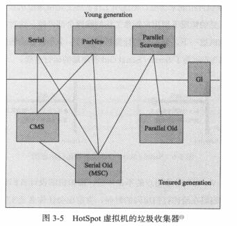

##### 什么是线程安全：

​	从某个线程开始访问到访问结束的整个过程，如果有一个访问对象被其他线程修改，那么对于当前线程而言就发生了线程安全问题；如果在整个访问过程中，无一对象被其他线程修改，就是线程安全的。

##### 哪些方式来实现线程安全：

​	消除共享数据

​	使用线程同步机制

​	建立副本

提高锁的性能

​	1.减少锁持有时间

​	2.减小所粒度（ConcurrentHashMap的Segment）

​	3.锁分离（ReadWriteLock）

​	4.锁粗化（将两个锁合并成一个锁）

​	5.无锁（CAS 非阻塞的同步   AtomicInteger）

##### 垃圾收集算法：

​	1.引用计数

​	2.标记-清扫

​	3.复制

​	4.标记-压缩

​	5.分代

##### 反射是什么：

​	反射机制是在运行状态中，对于任意一个类，都能够知道这个类的所有属性和方法，

​	对于任意一个对象，都能够条用它的任意一个方法和属性

​	这种动态获取的信息以及动态调用对象的方法的功能称为Java语言的反射机制

##### Java内存模型

从java源代码到最终实际执行的指令序列，会经过下面三种排序：

源代码-》1.编译器优化重排序-》2.指令级并行重排序（采用并行技术）-》3.内存系统重排序

从JDK1.5开始使用**happens-before**,相关规则如下：

​	1.程序顺序规则：一个线程中的每个操作，happens-before与该线程中的任意后续操作。

​	2.监视器锁的规则：对一个监视器的解锁，happens-before于随后对这个监视器的加锁。

​	3.volatile:对一个volatile域的写，happens-before于任意后续对这个域的写。

​	4.传递性：如果a->b  b->c  a  happens-before c

##### GC收集器与内存分配策略

引用计数     可达性分析（通过一系列的‘GC Roots’的对象作为起始点，开始向下搜索）

垃圾回收算法:

##### 标记-清除算法

​	分为“标记”和“清除”两个部分，首先标记出需要回收的对象，在标记完成后进行同一的回收。它主要有两个不足：效率问题和空间问题（标记清除会产生大量不连续的内存碎片），之后的算法都是基于该算法宽展，解决不足支出.

##### 复制算法:

​	为了解决效率问题，将内存划为相等的两块，每次只使用一块，每次对另块回收，空间牺牲大。

​	而是将内存分为一块较大的Eden区和两块相同的Survivor空间。HotSpot虚拟机默认Eden和survivor比例为8:1。

##### 标记整理：

​	针对老年代，与“标记-清除”算法一样，但后续不同，而是让所有存活的对象向一端移动，直接清除另一端。

##### 分代收集算法：

​	根据对象存活周期的不同将内存划分为几块：新生代 老年代，根据各个年代的特点 采用收集算法。  在新生代中，每次垃圾回收大，只用少量存活。选用复制算法，只需要复制出少量的存活对象就可完成垃圾收集。    老年代中对象存活率高、没有额外空间，选用”标记-清除“和”标记整理“

##### 垃圾收集器：

Serial收集器：

​	必须暂停其他所有的工作线程，直到它收集结束。

ParNew收集器：

​	Serial收集器的多线程版本

Parallel Scavenge:

​	新生代收集器 使用复制算法

Serial-old:

​	是Serial收集器的老年代版本   使用“标记-整理”

Parallel old:
​	是Parallel Scabenge 收集器的老年版本    使用“标记-整理”

CMS收集器：

​	以一种获取最短回收停顿时间为目标的收集器，基于“标记-清除”

G1收集器：

​	

-XX:PretenureSizeThreshold参数设置 ：令大于这个设置值的对象直接在老年代分配，这样做的目的避免在Eden区及两个Survivor区之间发生大量的内存复制

-XX:SurvivorRatio=8：新生代中Eden去与Survivor区的比，默认为8

-XX:MasTenuringThreshold:晋升到老年代的对象年龄，每个对象在坚持过一次Minor GC之后，年龄增加1，当超过这个参数值就进入老年代

如果对象在Eden出生并经历过第一次MinorGC后仍然存活，并且能被Survivor容纳的化，将被移动到Survivor空间中，并且对象年龄设为1，对象没经过一次+1，默认15 会被晋升到老年代

##### 面向对象的特征：

​	封装：保证软件有优良的模块性基础，实现软件部件的“高内聚，低耦合”。

​	继承：子类自动共享父类数据和方法的机制，提高软件的可重用性和扩展性。

​	多态：增强了软件的灵活性和扩展性      （继承，重写、向上转型）

##### 接口和抽象类区别（在应用上）

接口更多的实在系统架构设计方法发挥作用，主要用于定义模块之间的通信契约。抽象类在代码实现方面发挥作用，可以实现代码的重用。

##### GET和POST

​	get参数通过url传递，post放在request body中

​	get产生一个TCP数据包，POST产生两个TCP数据包

​	对于GET方式的请求，浏览器会把http header和data一并发送出去，服务器响应200（返回数据）；

​	而对于POST，浏览器先发送header，服务器响应100 continue，浏览器再发送data，服务器响应200 ok（返回数据）。

##### JDBC流程

​	注册驱动，建立连接，创建运行sql语句（Statement），运行语句，处理结果（ResultSet）,释放资源

##### MVC设计思想：

​	model view controller    将应用的输入、处理、输出按照模型层、视图层、控制层进行分层设计。

##### sleep、wait、yield、join

​	sleep:线程指定暂停，不会释放所标记

​	wait：notify/notifyAll

​	yield:暂停当前正在执行的线程对象，只是使当前线程重新回到可执行状态，所以执行yield的线程有可能在进入到可执行状态或者马上又被执行

​	join:等待该线程终止，等待调用join方法的线程结束，再继续执行

##### ThreadLocal：